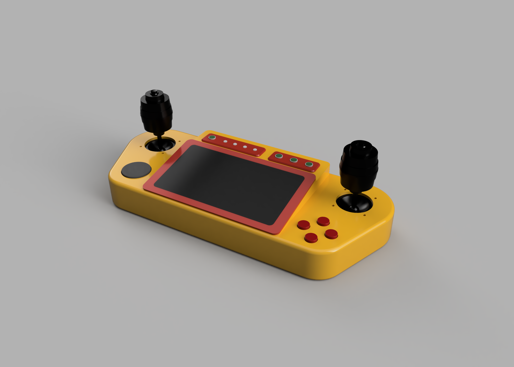

# Robot Controller

Robot controller for use with [ROS](https://www.ros.org/) 



# Hardware

- [Waveshare 5.5inch AMOLED screen](https://www.waveshare.com/wiki/5.5inch_HDMI_AMOLED)
- Rasbperry Pi 4 or similar
- STM32F103 BluePill micro controller
- 2x JH-D300X-R4 3 Axis joystick
- [Adafruit ANO Rotary Encoder](https://learn.adafruit.com/ano-rotary-encoder)
- 4x [Sparkfun LED Tactile Button](https://www.sparkfun.com/products/10439)
- 4x [Sparkfun LED Tactile Button Breakout](https://www.sparkfun.com/products/10467)
- 4x 12mm Tactile Push button
- 4x [Adafruit RGB Smart NeoPixel](https://www.adafruit.com/product/1558)

# 3d Model

See [model](doc/model/)

# Schematic 

See documentation [schematic](doc/Schematic.pdf)

Button breakout board [gerber](doc/Button-breakout-board.zip)
Controller board [gerber](doc/Controller-board.zip)

# USB HID Vendor features

The output mapping can be set via the `send_cmd.py` utility in the `tools` folder, or by using the `Controller` class in `tools/controller.py`
```
./tools/send_cmd.py <options>
```

## Outputs
|index|name|description|
|---    |---        |---    |
|0      |EXT_OUT1   |External output pin|
|1      |EXT_OUT2   |External output pin|
|2      |LED1       |Single color led|
|3      |LED2       |Single color led|
|4      |LED3       |Single color led|
|5      |LED4       |Single color led|
|6      |NEOPIXEL1  |RGB Led|
|7      |NEOPIXEL2  |RGB Led|
|8      |NEOPIXEL3  |RGB Led|
|9      |NEOPIXEL4  |RGB Led|

## Inputs
|index|name|description|
|   ---|---        |---    |
|0|FALSE        |Always false|
|1|TRUE         |Always true|
|2|EXT_IN1      |External input pin|
|3|EXT_IN2      |External input pin|
|4|ANO_SW1      |ANO Dial switch|
|5|ANO_SW2      |ANO Dial switch|
|6|ANO_SW3      |ANO Dial switch|
|7|ANO_SW4      |ANO Dial switch|
|8|ANO_SW5      |ANO Dial switch|
|9|BUTTON1      |Push Button|
|10|BUTTON2     |Push Button|
|11|BUTTON3     |Push Button|
|12|BUTTON4     |Push Button|
|13|BUTTON5     |Push Button|
|14|BUTTON6     |Push Button|
|15|BUTTON7     |Push Button|
|16|BUTTON8     |Push Button|
|17|USB_LED1    |USB HID Led (Standby)|
|18|USB_LED2    |USB HID Led (Suspend)|
|19|USB_LED3    |USB HID Led (Charging)|
|20|USB_LED4    |USB HID Led (Message)|
|21|USB_LED5    |USB HID Led (Generic)|
|22|SOFT1       |Software controlled input|
|23|SOFT2       |Software controlled input|
|24|SOFT3       |Software controlled input|
|25|SOFT4       |Software controlled input|
|26|SOFT5       |Software controlled input|
|27|SOFT6       |Software controlled input|
|28|SOFT7       |Software controlled input|
|29|SOFT8       |Software controlled input|
|30|SOFT9       |Software controlled input|
|31|SOFT10      |Software controlled input|


## Output config 
Each output has 4 config config entries. The first entry where enables evaluates to true is used.

|index  |enable     |enable_inv |active     |active_inv |active_mode        |passive_mode   |primary_lut    |secondary_lut  |
|---    |---        |---        |---        |---        |---                |---            |---            |---            |
|0      |input_idx  |bool       |input_idx  |bool       |mode_idx           |mode_idx       |lut_idx        |lut_idx        |
|1      |input_idx  |bool       |input_idx  |bool       |mode_idx           |mode_idx       |lut_idx        |lut_idx        |
|2      |input_idx  |bool       |input_idx  |bool       |mode_idx           |mode_idx       |lut_idx        |lut_idx        |
|3      |input_idx  |bool       |input_idx  |bool       |mode_idx           |mode_idx       |lut_idx        |lut_idx        |

## Mode config
Mode defines how long time an outpus spends in active and passive state when it is active on an output.

|index  |active_time|passive_time|rise_time|fall_time   |
|---    |---        |---         |---      |---         |
|0      |duration ms |duration ms |duration ms |duration ms|
|...    |duration ms |duration ms |duration ms |duration ms|
|15     |duration ms |duration ms |duration ms |duration ms|

## Brightness LUT
|index  |brightness|
|---    |---    |
|0      |16 bit brightness value|
|...    |16 bit brightness value|
|15     |16 bit brightness value|

## Color LUT

|index  |red|green|blue|
|---    |---    |--- |--- |
|0      |8 bit value|8 bit value|8 bit value|
|...    |8 bit value|8 bit value|8 bit value|
|15     |8 bit value|8 bit value|8 bit value|


# Microcontroller

## Pinout

|Function|Mode|Pin||Pin|Mode|Function|
|---        |---    |--- |---|--- |---  |---        |
|           |       |    |USB|    |     |           |
|ANO_SW5    |GPIO   |PB12|   |GND |     |           |
|ANO_SW4    |GPIO   |PB13|   |GND |     |           |
|ANO_SW3    |GPIO   |PB14|   |3V3 |     |           |
|ANO_SW2    |GPIO   |PB15|   |NRST|     |           |
|ANO_SW1    |GPIO   |PA8 |   |PB11|GPIO |EXT_OUT2   |
|DEBUG      |UART1  |PA9 |   |PB10|GPIO |EXT_OUT1   |
|DEBUG      |UART1  |PA10|   |PB1 |PWM  |LED4       |
|USB        |USB    |PA11|   |PB0 |PWM  |LED3       |
|USB        |USB    |PA12|   |PA7 |GPIO |EXT_IN2    |
|NEOPIXEL   |PWM    |PA15|   |PA6 |ADC6 |VSENSE     |
|ANO_ENCB   |GPIO   |PB3 |   |PA5 |ADC5 |RIGHT_Z    |
|ANO_ENCA   |GPIO   |PB4 |   |PA4 |ADC4 |RIGHT_Y    |
|EXT_IN1    |GPIO   |PB5 |   |PA3 |ADC3 |RIGHT_X    |
|LED2       |PWM    |PB6 |   |PA2 |ADC2 |LEFT_Z     |
|LED1       |PWM    |PB7 |   |PA1 |ADC1 |LEFT_Y     |
|PCF8574_SCL|SCL1   |PB8 |   |PA0 |ADC0 |LEFT_X     |
|PCF8574_SDA|SDA1   |PB9 |   |PC15|GPIO |PCF8574_INT|
|           |       |5V  |   |PC14|GPIO |AUX        |
|           |       |GND |   |PC13|     |           |
|           |       |3V3 |   |VBAT|     |           |


## PCF8574AN (i2c gpio expander)
|Pin|Function|
|---|---|
|0|RIGHT_X|
|1|RIGHT_Y|
|2|RIGHT_A|
|3|RIGHT_B|
|4|TOP_SW1|
|5|TOP_SW2|
|6|TOP_SW3|
|7|TOP_PWR_SW|


## Timer usage

|Timer|Usage|
|---|---|
|1|Axis ADC|
|2|LED|
|3|PWM|
|4|PWM|


